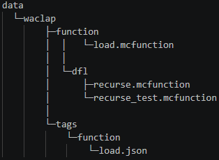

# Datapack Filer Language
## 概要
Datapack Filer Language(以降Dfl)は「ファイルの生成」「ファイルへの書き込み」などの動作を命令として表現する言語です.

## コード例
<details>
<summary> コード例を表示 </summary>

```
* function example
pushType waclap function mcfunction
open load
    / scoreboard objectives add dfl_example dummy
    > execute as @a at @s run |
    call dfl/recurse_test
close

set maxRecurseCount = 20
open dfl/recurse_test
    / scoreboard players set @a[distance=..10] dfl_example 0
    > execute as @a[distance=..10] at @s run |
    open dfl/recurse ** {type:"flame"}
        / execute if score @s dfl_example matches %{maxRecurseCount}.. run return
        / scoreboard players add @s dfl_example 1
        / particle $(type) ~ ~ ~ 0.1 0.1 0.1 0.5 10
        recurse {type:"angry_villager"}
    close
    call otherlib:hello
close

popType

***
 tags from here
***

pushType waclap tags json
open function/load
    ///
    {
      "values": [
        "waclap:load"
      ]
    }
    ///
close
popType
```
</details>

## 実行結果
※ ソースコードをsrc.dfl, 生成ディレクトリをgenとしてコンパイルした.
<div align="left">
    
</div>

<summary>但し書きを表示</summary>

ここに詳細な注記や例外規定などを記載します。
Markdownの記述も内部で使えます。

